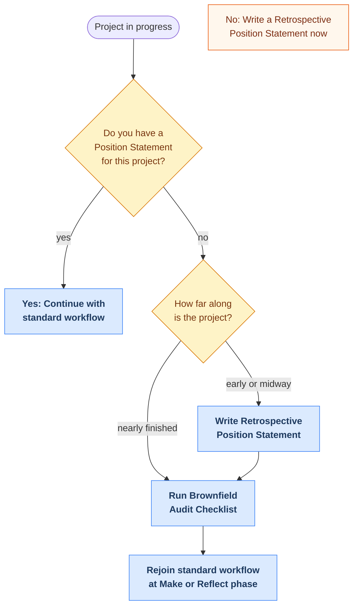

# ESF Workflow

The ESF Level 2 process keeps your thinking at the center of everything you produce with AI.

**The core rule:** You think first. AI assists second. Your Position Statement must exist before any AI tool opens.

---

## Your Process: Inquire → Position → Explore → Make → Reflect

```mermaid
flowchart TD
    classDef humanOnly fill:#dbeafe,stroke:#3b82f6,color:#1e3a5f,font-weight:bold
    classDef aiAssisted fill:#dcfce7,stroke:#16a34a,color:#14532d
    classDef gate fill:#fef3c7,stroke:#d97706,color:#78350f
    classDef artifact fill:#f3e8ff,stroke:#9333ea,color:#3b0764
    classDef blocked fill:#fee2e2,stroke:#dc2626,color:#7f1d1d

    BRIEF(["📄 Project Brief\nfrom your instructor\n→ save to projects/briefs/"]):::artifact

    subgraph HUMANONLY["  Phases 1–2 · Human Only · No AI  "]
        P1["1 · Inquire\nRead the brief carefully.\nAsk yourself:\n• What is this actually asking?\n• What do I already know?\n• What am I uncertain about?\n• What assumptions am I making?"]:::humanOnly

        P2["2 · Position ✍️\nWrite your Position Statement, without AI.\n• What is my position or approach?\n• What matters most to me in this work?\n• What will I not compromise on?\n\n200–400 words · rough is fine\nsave to projects/[context]/position-statements/"]:::humanOnly
    end

    GATE{"Position Statement\nfile exists?"}:::gate
    BLOCKED["⛔ I can't help with this project yet.\n\nYou need a Position Statement first.\nThis is not a rule; it is the mechanism\nthat keeps your work yours.\n\nOnce you have one saved,\ncome back and we'll begin."]:::blocked

    subgraph AIASSISTED["  Phases 3–4 · AI-Assisted · Position Statement is your anchor  "]
        P3["3 · Explore\nNow bring AI in as a thinking partner,\nnot a producer.\n\n• First: AI does a readability pass on\n  your Position Statement (you confirm)\n• Ask AI to generate alternatives\n• Ask AI to challenge your position\n• Ask AI to find relevant examples\n• Evaluate everything against\n  your Position Statement"]:::aiAssisted

        P4["4 · Make\nBuild the work product with AI assistance.\n\n• Check each section against your Position Statement\n• If AI departs from your position, decide consciously\n• Apply the Five Questions at each major section\n• Record of Resistance: document what you\n  kept · revised · rejected and why"]:::aiAssisted
    end

    P5["5 · Reflect\nLook back at the full trajectory.\n\n• Compare your final work to your Position Statement\n• What changed? What held?\n• Where did AI shape your direction most?\n• Was that productive, or did it pull you away?\n• Write your honest disclosure\n  (AI may check completeness + readability after you draft)"]:::humanOnly

    FQ(["The Five Questions\nApply from Phase 3 onward:\n1. Can I defend this?\n2. Is this mine?\n3. Did I verify?\n4. Would I teach this?\n5. Is my disclosure honest?"]):::artifact

    DISCLOSURE(["📝 Disclosure\nAt the end of every submission:\nspecific · honest · yours"]):::artifact

    BRIEF --> P1
    P1 -->|"Gate: Can I explain this\nin my own words, without the brief?"| P2
    P2 --> GATE
    GATE -->|"✓ yes"| P3
    GATE -->|"✗ no"| BLOCKED
    BLOCKED -.->|"write it,\nsave it,\nthen return"| P2
    P3 -->|"Gate: Can I distinguish\nmy ideas from AI's suggestions?"| P4
    P4 -->|"Gate: Does this still reflect\nmy position, or did I drift?"| P5
    P5 -->|"Gate: Can I defend\nevery part of this?"| DISCLOSURE
    P3 -.-> FQ
    P4 -.-> FQ
```



---

## The Position Statement

*In professional practice, this is a creative brief. Learning to write one now means you can define and defend creative direction when the audience is a client, a creative director, or a hiring committee.*

Your Position Statement is the most important thing you write before starting a project. It goes in `projects/[context]/position-statements/` before any AI tool opens.

**Three things it contains:**

| Element | Question | Example |
|---------|----------|---------|
| **Position** | What do I think, want to argue, or want to create? | *"This poster series should make climate data feel personal, not abstract."* |
| **Emphasis** | What matters most? What should I avoid? | *"Emphasize the emotional connection. De-emphasize statistics."* |
| **Non-negotiables** | What must be present, no matter what AI suggests? | *"Every piece must be reworked by hand. AI images are reference only."* |

Takes 5 to 10 minutes. Rough outlines and bullet points are fine. Those minutes are where the learning happens. AI cleans up readability at the start of Phase 3.

**For technical or creative computing projects:** Include a sketch or diagram showing how your system is intended to work: what receives input, how it processes, and what it outputs. A physical drawing, a digital wireframe, or a Mermaid diagram in your project repository all qualify. This becomes the visual anchor for your intent before you build.

---

## Records of Resistance

*In a studio, this is called design rationale: the documented reasoning behind what you kept, changed, and rejected. Employers and collaborators expect you to explain your decisions, not just show the result.*

The most revealing evidence of your thinking is not what you accepted from AI; it's what you **rejected**.

Document it in `projects/[context]/records-of-resistance/`:

```
AI suggested: [what the AI produced]
I decided: [keep / revise / reject]
Because: [your reasoning, referencing your Position Statement]
```

These are not busywork. They are proof you were directing the process, not following it.

**For code-based projects:** Annotated Git commits qualify as Records of Resistance. A commit message that describes both the action and the reasoning ("Reverted AI-generated layout; spacing conflicted with my Position Statement") documents the same editorial judgment as the format above.

---

## Multi-Session Work

Long or complex projects often span multiple AI sessions. At the start of each new session, briefly re-establish your Position Statement and the key decisions you made in the previous session. What you choose to re-establish tells you what your highest-weight decisions are: the ones only you can hold across time.

Keep a running note of what you re-introduce to AI at each session start. At the end of the project, that note is evidence of what stayed yours throughout.

---

## Starting Mid-Project: The Brownfield Pathway

You may encounter this framework after you have already started working on a project with AI. Maybe you used ChatGPT to brainstorm and draft before your instructor introduced the Position Statement process. Maybe you are halfway through a project and realize you never wrote down what you actually think before AI started shaping the direction.

The brownfield pathway lets you adopt ESF practices without starting over. It is not a shortcut. It is an honest reckoning with where you are.

### When to Use This

- You have already started a project with AI assistance but without a Position Statement
- Your instructor introduces ESF mid-quarter and you have work in progress
- You realize partway through that you cannot distinguish your ideas from AI's suggestions

### Decision: Brownfield or Greenfield?



### The Retrospective Position Statement

A standard Position Statement captures your thinking before AI enters. A Retrospective Position Statement forces you to separate your thinking from AI's after the fact. This is harder, not easier. You have to be honest about what was yours and what you absorbed from AI without questioning it.

Close your AI tools. Open a blank document. Answer these questions without looking at your project:

1. **What is my position?** What am I actually trying to say, argue, or create in this project? Not what AI helped me draft. What do *I* think?
2. **What matters most?** If I had to cut this project to its core, what would survive? Was that always my priority, or did AI steer me toward something else?
3. **What is non-negotiable?** What must stay, regardless of what AI suggested or what my peers think? What am I willing to fight for in a crit?

Save it to `projects/[context]/position-statements/` like any other Position Statement. Note in the file that it is retrospective.

Now re-read your project with your Position Statement next to it. Where do they match? Where did you drift? The drift is where your learning is.

### Brownfield Audit Checklist

Go through your existing work section by section.

**Layer in immediately:**
- [ ] Write the Retrospective Position Statement (above)
- [ ] Run the Five Questions against each completed section of your project
- [ ] Start a Record of Resistance for decisions you make from this point forward
- [ ] For remaining work, use the standard Explore → Make process with your Position Statement as anchor

**Layer in on next iteration:**
- [ ] Rewrite sections where you cannot answer "Is this mine?" with confidence
- [ ] Align your project's direction to your Retrospective Position Statement
- [ ] Add a disclosure statement to your submission

**Accept for this submission:**
- [ ] Sections that pass the Five Questions can stand, even if you wrote them without a Position Statement
- [ ] You do not need to redo work that genuinely reflects your intent

### Worked Example: Brownfield Adoption

Marcus is three weeks into a second course project. He used ChatGPT extensively to brainstorm his concept and draft his project proposal. His instructor just introduced the Position Statement requirement. Marcus does not have one, and he is not sure which ideas in his proposal are his and which came from the AI conversation.

**Step 1: Retrospective Position Statement.** He closes ChatGPT, opens a blank document, and writes from memory:

> **My position:** I want this project to explore how confirmation bias affects the way designers select reference images. We default to what looks familiar, and AI image tools amplify that by giving us more of what we already like.
>
> **What matters most:** The experience of catching yourself in the bias. I want whoever interacts with this project to feel the moment where they realize they are just asking for the same thing over and over.
>
> **Non-negotiable:** The project has to be interactive, not a poster or essay. The viewer has to participate in the bias to understand it.

**Step 2: Brownfield Audit.** He compares his Position Statement to his existing proposal:

- Five Questions on his concept description: Passes. The core idea is clearly his; he had it before he opened ChatGPT.
- Five Questions on his "methodology" section: Fails Question 2. The methodology reads like a generic design process. AI wrote most of it and Marcus accepted it because it sounded professional. He cannot defend the specific steps.
- Five Questions on his reference list: Partially passes. Three of five references are ones he found himself. Two were AI suggestions he did not verify.

**Step 3: Targeted revision.** He rewrites his methodology to describe what he will actually do, in his own words. He verifies the two AI-suggested references and keeps one (it exists and is relevant) and removes one (it does not say what the AI claimed). He starts a Record of Resistance log for all future AI interactions.

**Step 4: Forward commitment.** For the remaining project work, Marcus uses his Retrospective Position Statement as his anchor. When AI suggests directions, he checks them against his three answers. He now has the same foundation a greenfield user would have, just arrived at from a different direction.

**Total time added:** about 45 minutes. He did not restart his project. He identified what was genuinely his, fixed what was not, and moved forward with clarity.

### Forward Commitment

The Retrospective Position Statement is your anchor for the rest of this project. Use it the same way you would use a standard Position Statement: check AI output against it, record your resistance, apply the Five Questions.

For your next project, write the Position Statement first. The brownfield pathway exists so you can get into the process. The standard workflow is where you stay.

---

## Build Practice: Define, Order, Check

*In professional practice, this is project scoping and task management. Before you build, you break the work into parts, decide what matters most, and track progress against the original brief. Learning to do this with AI means you can manage complex creative projects without losing control of the direction.*

Build Practice structures what happens inside Phase 4 (Make). Before you start building, apply three moves.

### 1. Define

Name each piece of your project. If you cannot name it clearly, you do not yet understand it well enough to direct it. Classify each piece by its epistemic weight:

| Weight | What It Means | Your Role |
|--------|--------------|-----------|
| **High** [H] | Creative rationale, concept, system design, artistic decisions | Your original thinking drives it. AI informs, not leads. |
| **Medium** [M] | Technical implementation, code structure, documentation | Your judgment shapes it. AI can help draft and execute. |
| **Low** [L] | Formatting, boilerplate, administrative text | AI handles it with light review from you. |

### 2. Order

Work the high-weight pieces first, when your Position Statement is freshest and your creative intent is sharpest. Note dependencies: which pieces need other pieces to be done first, and which can move independently.

If your course uses the Agile Design Practice framework, your defined pieces go on your Studio Board with weight tags. The "To Make" column shows what is coming. The weight tag tells you what order to work them. High-weight items move into "Making" first.

```
STUDIO BOARD (with Build Practice)
─────────────────────────────────────────────────
  To Make          │  Making (2-3 max)  │  Made
─────────────────────────────────────────────────
  ■ Pipeline [H]   │  ■ Concept art [H] │  ■ README [L] ✓
  ■ Interaction [H] │                    │
  ■ Code struct [M] │                    │
  ■ Credits [L]    │                    │
─────────────────────────────────────────────────
  [H] = high weight: full Position Statement check
  [M] = medium weight: quick intent check
  [L] = low weight: skim for drift
```

### 3. Check

After completing each piece, ask: does this still reflect my Position Statement, or did I drift? This is a quick alignment check, not the full Five Questions. If you drifted, decide whether the drift was deliberate (update your Position Statement) or accidental (correct course before starting the next piece).

For code-based projects, each piece's check can coincide with an annotated commit. A commit message that captures both the action and whether the piece still reflects your intent ("Built interaction layer; aligns with Position Statement re: user agency") is a check and a Record of Resistance in one.

Build Practice scales to the task. For a short exercise, the three moves may be a 30-second mental pass. For a multi-week project, they produce visible artifacts: a piece list in your process blog, a Studio Board with weight tags, and per-piece check notes. The discipline is the same either way.

---

## The Five Questions

*These are the questions every creative professional answers during review: Can you defend the work? Is it yours? Did you verify? Can you explain it? Is your documentation honest? Practicing them here builds the reflex you will rely on in professional critiques and client presentations.*

Apply these at major decision points, after completing a section, and before submitting. They are the full ownership audit, deeper than the per-piece Check in Build Practice.

| # | Question | Red Flag |
|---|----------|----------|
| 1 | **Can I defend this?** | You can't explain a decision without saying "the AI suggested it" |
| 2 | **Is this mine?** | Did I direct this, or accept AI's framing? (design authority test) |
| 3 | **Did I verify?** | Sources or facts you haven't independently checked |
| 4 | **Would I teach this?** | You can't explain your process in a way that demonstrates learning |
| 5 | **Is my disclosure honest?** | Your disclosure understates AI involvement to protect your grade |

**Check and the Five Questions work together.** Check is the quick pulse during building: "Am I still aligned with my intent?" The Five Questions are the full exam at the gates: "Can I defend this as mine?" You need both. Check without the Five Questions detects drift but not passive acceptance. The Five Questions without Check arrive too late to catch incremental erosion.

If any answer is **no**, you have three options:
1. Revise the work until the answer becomes yes
2. Do more of the work yourself
3. Disclose accurately. Honesty about a mistake is always better than concealment

---

## Engagement Levels

*Each level maps to increasing professional independence: from guided exploration to directing your own process. By Level 4, you are operating the way senior creatives work with AI in studios and agencies.*

**Phases are the per-project process.** You run all five phases on every project, at every level. **Engagement levels are your position in the curriculum.** You progress through levels over multiple courses as your practice matures. They are independent: a Level 4 user still completes all five phases on each project.

Your process deepens across the AI curriculum.

| Stage | Level | What Changes |
|--------|-------|-------------|
| DISCOVER | Discovery | Instructor scaffolds gates. Learn the Inquire + Position sequence. |
| THINK | Guided Use | Full process within structured parameters. Position Statement required. |
| BUILD | Independent Use | You run the process yourself. Peer-reviewed gates. |
| DESIGN | Critical Partnership | You design your own gates. Mentor others through the process. |
